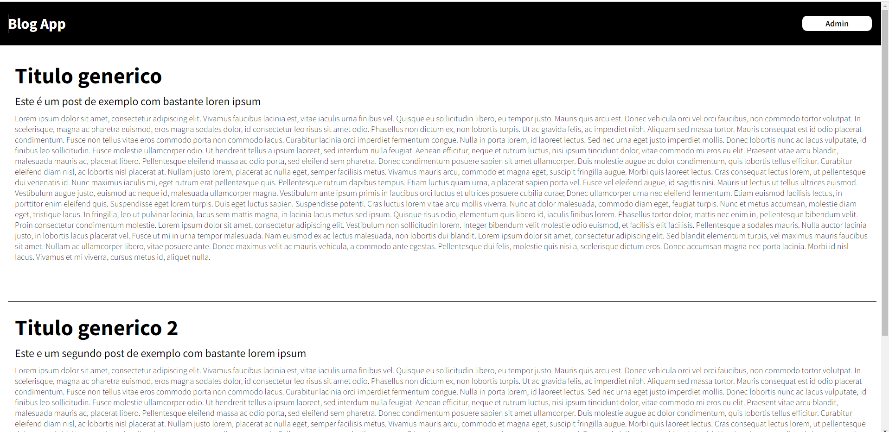
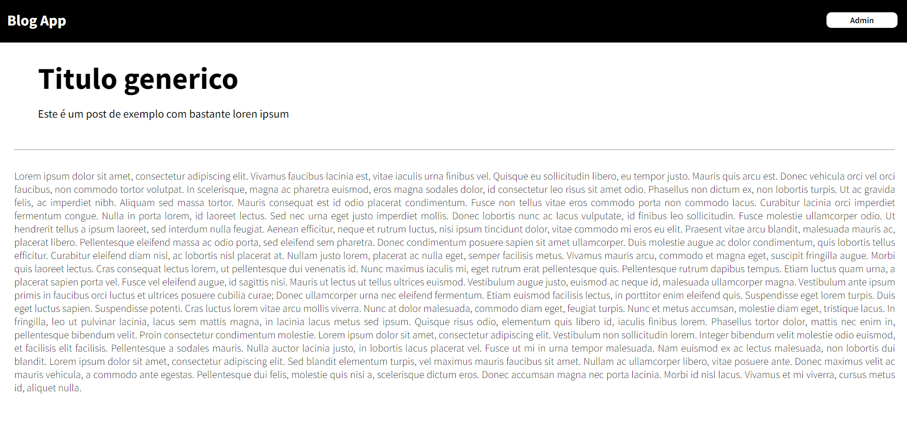
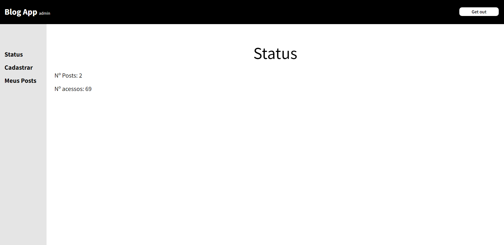
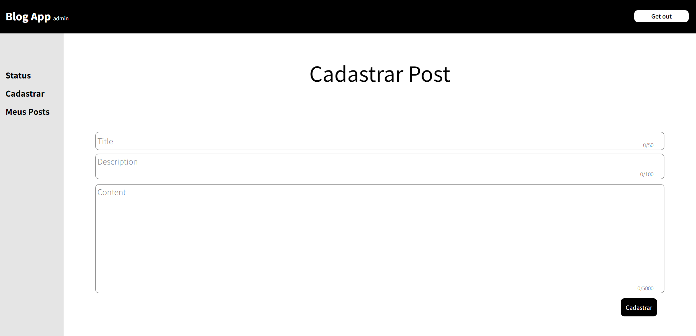
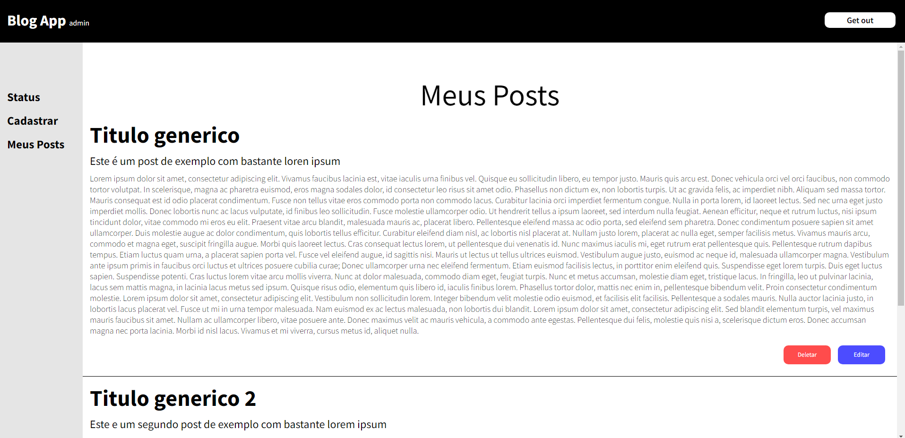
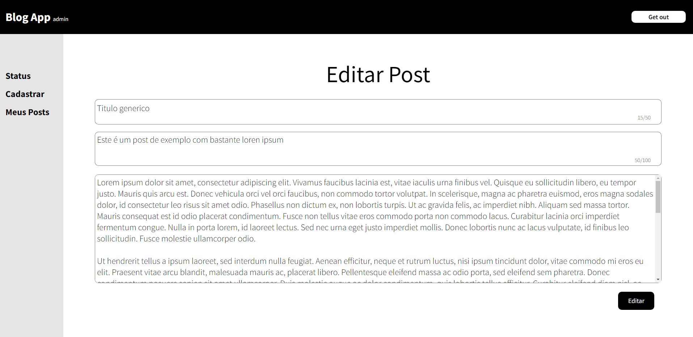

# Blog App
Uma aplicação simples de um blog, com um painel administrativo que gera, edita e exclui os postos através de uma api também criada para este projeto em node js.

   
## SUMÁRIO

- Status
- Deploy
- Features
- Demonstração da Aplicação
- Como Rodar a Aplicação
- Pré Requisitos Para Rodar a Aplicação
- Tecnologias utilizadas
- Autor

## Status

✨Concluído ✨

## Deploy

- [https://bloogappclient.herokuapp.com/](https://bloogappclient.herokuapp.com/)

## Features

- Leitor de posts
- Listagem de posts
- Painel administrativos para criação, edição e remoção de posts
- Painel administrativo que mostra o numero de posts e a quantidade de acessos no site
- aplicação resonsiva

## Demonstração da Aplicação

### Blog App Desktop 1

### Blog App Desktop 2

### Blog App Desktop 3

### Blog App Desktop 4

### Blog App Desktop 5

### Blog App Desktop 6

## Pré Requisitos Para Rodar a Aplicação

- Instalar o Node Js.

## Como Rodar a Aplicação

Pelo promt de comando entre na pasta do projeto, em seguida rode o comando npm install (para instalar as dependências), e por fim, rode o comando npm start (para que o projeto seja iniciado no navegador).

## Tecnologias Utilizadas

- [React_Js](https://pt-br.reactjs.org/docs/getting-started.html)
- [React_Router](https://github.com/atlassian/react-beautiful-dndhttps://v5.reactrouter.com/web/guides/quick-start)
- [Styled-Components](https://styled-components.com/docs)
- [Axios](https://axios-http.com/ptbr/docs/intro)

## Autor

Feito por Vitor Mateus

 
